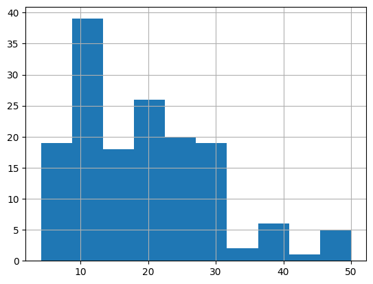
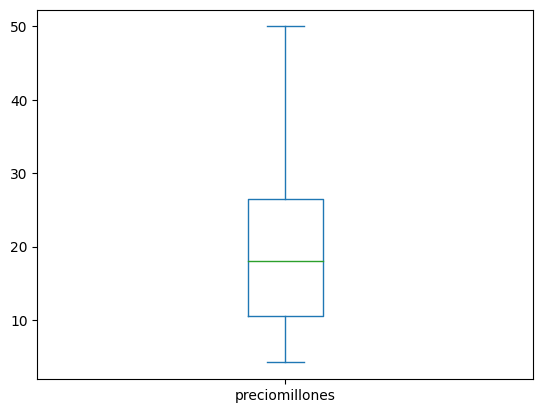
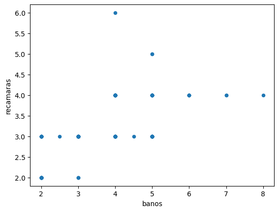

# Sesión 02: Estructuras de datos
## 2.1 Carga de los datos

Como primer paso debemos indicar qué biblioteca vamos a emplear para importar los datos. En este caso utilizaremos *pandas* con el alias *pd*. El nombre de pandas proviene de *panel data*. 


```python
import pandas as pd
```

Luego, utilizaremos una función para leer el archivo en la cual agregaremos como argumentos la ubicación del archivo (*path*) y el nombre del archivo:


```python
df = pd.read_excel('data/bd01_casas.xlsx')
```

Siempre se debe indicar la ubicación del archivo, a menos que el archivo esté en el mismo directorio del Jupyter notebook. Adicionalmente, se pueden incluir algunas instrucciones mediante otros argumentos.

Los formatos más comunes son *csv* (comma separated value) y excel por lo que lo más frecuente es usar *read_excel* y *read_csv*. Dependiendo del tipo de archivo, también están disponibles funciones como *read_json*, *read_sas*, *read_stata*, *read_sql* y al menos una docena más. Por ejemplo, ve a la siguiente liga y copia la tabla con las empresas incluidas en el IPC de la BMV: https://finance.yahoo.com/quote/%5EMXX/components/ y ejecuta la siguiente instrucción:


```python
# Este comando se usa cuando copiamos datos de Excel, el comando pega lo que tenemos en clipboard
# ipc = pd.read_clipboard()
# ipc
```

### Dataframes

Una forma muy común de organizar los datos es en filas y columnas. Cada fila corresponde a una observación (elemento, objeto, caso, individuo, evento), y cada columna corresponde a una variable (en machine learning las variables se les conoce como *features*). En Pandas, a este tipo de ordenamiento se le conoce como DataFrame y la función que utilizamos importa los datos en un dataframe.


```python
df
```

<div>
<table border="1" class="dataframe">
  <thead>
    <tr style="text-align: right;">
      <th></th>
      <th>operacion</th>
      <th>tipo</th>
      <th>municipio</th>
      <th>colonia</th>
      <th>preciomillones</th>
      <th>recamaras</th>
      <th>baños</th>
      <th>construccion</th>
    </tr>
  </thead>
  <tbody>
    <tr>
      <th>0</th>
      <td>Venta</td>
      <td>1</td>
      <td>San Pedro Garza García</td>
      <td>Colonia Del Valle</td>
      <td>4.20</td>
      <td>3</td>
      <td>2.0</td>
      <td>130</td>
    </tr>
    <tr>
      <th>1</th>
      <td>Venta</td>
      <td>0</td>
      <td>San Pedro Garza García</td>
      <td>Colonia Del Valle</td>
      <td>5.10</td>
      <td>3</td>
      <td>5.0</td>
      <td>280</td>
    </tr>
    <tr>
      <th>2</th>
      <td>Venta</td>
      <td>1</td>
      <td>San Pedro Garza García</td>
      <td>Colonia Del Valle</td>
      <td>5.50</td>
      <td>2</td>
      <td>2.0</td>
      <td>112</td>
    </tr>
    <tr>
      <th>3</th>
      <td>Venta</td>
      <td>1</td>
      <td>San Pedro Garza García</td>
      <td>Colonia Del Valle</td>
      <td>5.70</td>
      <td>2</td>
      <td>2.0</td>
      <td>112</td>
    </tr>
    <tr>
      <th>4</th>
      <td>Venta</td>
      <td>1</td>
      <td>San Pedro Garza García</td>
      <td>Colonia Del Valle</td>
      <td>5.80</td>
      <td>2</td>
      <td>2.0</td>
      <td>112</td>
    </tr>
  </tbody>
</table>
<p>155 rows × 8 columns</p>
</div>


Observa que una característica adicional es que cuentan con un índice para las filas. En principio, este índice es secuencial empezando por cero, pero puede ser sustituido por un ID, una fecha o cualquier otra variable. Un dataframe puede incluso tener varios índices para representar objetos multidimensionales (cubos de datos).

Para seleccionar solamente una columna utiliza corchetes o notación con punto, por ejemplo df['recamaras'] o df.recamaras. Al seleccionar una sola columna esta se mostrará como una serie.


```python
df['recamaras']
```


    0      3
    1      3
    2      2
    3      2
    4      2
          ..
    150    3
    151    3
    152    4
    153    4
    154    4
    Name: recamaras, Length: 155, dtype: int64


Para seleccionar múltiples columnas, agrega las columnas en una lista:


```python
df[['recamaras', 'baños']]
```


<div>
<table border="1" class="dataframe">
  <thead>
    <tr style="text-align: right;">
      <th></th>
      <th>recamaras</th>
      <th>baños</th>
    </tr>
  </thead>
  <tbody>
    <tr>
      <th>0</th>
      <td>3</td>
      <td>2.0</td>
    </tr>
    <tr>
      <th>1</th>
      <td>3</td>
      <td>5.0</td>
    </tr>
    <tr>
      <th>2</th>
      <td>2</td>
      <td>2.0</td>
    </tr>
    <tr>
      <th>3</th>
      <td>2</td>
      <td>2.0</td>
    </tr>
    <tr>
      <th>4</th>
      <td>2</td>
      <td>2.0</td>
    </tr>
    <tr>
      <th>...</th>
      <td>...</td>
      <td>...</td>
    </tr>
    <tr>
      <th>150</th>
      <td>3</td>
      <td>5.0</td>
    </tr>
    <tr>
      <th>151</th>
      <td>3</td>
      <td>4.0</td>
    </tr>
    <tr>
      <th>152</th>
      <td>4</td>
      <td>5.0</td>
    </tr>
    <tr>
      <th>153</th>
      <td>4</td>
      <td>4.0</td>
    </tr>
    <tr>
      <th>154</th>
      <td>4</td>
      <td>6.0</td>
    </tr>
  </tbody>
</table>
<p>155 rows × 2 columns</p>
</div>


Es posible hacer operaciones con columnas. Por ejemplo


```python
df['preciom2'] = (df['preciomillones'] / df['construccion']) * 1000000
df
```


<div>
<table border="1" class="dataframe">
  <thead>
    <tr style="text-align: right;">
      <th></th>
      <th>operacion</th>
      <th>tipo</th>
      <th>municipio</th>
      <th>colonia</th>
      <th>preciomillones</th>
      <th>recamaras</th>
      <th>baños</th>
      <th>construccion</th>
      <th>preciom2</th>
    </tr>
  </thead>
  <tbody>
    <tr>
      <th>0</th>
      <td>Venta</td>
      <td>1</td>
      <td>San Pedro Garza García</td>
      <td>Colonia Del Valle</td>
      <td>4.20</td>
      <td>3</td>
      <td>2.0</td>
      <td>130</td>
      <td>32307.692308</td>
    </tr>
    <tr>
      <th>1</th>
      <td>Venta</td>
      <td>0</td>
      <td>San Pedro Garza García</td>
      <td>Colonia Del Valle</td>
      <td>5.10</td>
      <td>3</td>
      <td>5.0</td>
      <td>280</td>
      <td>18214.285714</td>
    </tr>
    <tr>
      <th>2</th>
      <td>Venta</td>
      <td>1</td>
      <td>San Pedro Garza García</td>
      <td>Colonia Del Valle</td>
      <td>5.50</td>
      <td>2</td>
      <td>2.0</td>
      <td>112</td>
      <td>49107.142857</td>
    </tr>
    <tr>
      <th>3</th>
      <td>Venta</td>
      <td>1</td>
      <td>San Pedro Garza García</td>
      <td>Colonia Del Valle</td>
      <td>5.70</td>
      <td>2</td>
      <td>2.0</td>
      <td>112</td>
      <td>50892.857143</td>
    </tr>
    <tr>
      <th>4</th>
      <td>Venta</td>
      <td>1</td>
      <td>San Pedro Garza García</td>
      <td>Colonia Del Valle</td>
      <td>5.80</td>
      <td>2</td>
      <td>2.0</td>
      <td>112</td>
      <td>51785.714286</td>
    </tr>
  </tbody>
</table>
<p>155 rows × 9 columns</p>
</div>


## 2.2 Revisión de los datos

### Revisa los primeros renglones

Siempre es útil revisar los primeros renglones del dataframe para verificar que los datos estén en el formato apropiado. Para ello, vamos a utilizar el método *head( )*. 

Un método es una función asociada a un dataframe y se utiliza un punto para indicar esta asociación, por ejemplo *df.head()*. 

Un método tiene parámetros que van entre paréntesis. En el caso de *.head()* podemos agregar el número de renglones que deseamos visualizar. De manera predeterminada este número es de 5 renglones


```python
df.head(5)
```


<div>
<table border="1" class="dataframe">
  <thead>
    <tr style="text-align: right;">
      <th></th>
      <th>operacion</th>
      <th>tipo</th>
      <th>municipio</th>
      <th>colonia</th>
      <th>preciomillones</th>
      <th>recamaras</th>
      <th>baños</th>
      <th>construccion</th>
      <th>preciom2</th>
    </tr>
  </thead>
  <tbody>
    <tr>
      <th>0</th>
      <td>Venta</td>
      <td>1</td>
      <td>San Pedro Garza García</td>
      <td>Colonia Del Valle</td>
      <td>4.2</td>
      <td>3</td>
      <td>2.0</td>
      <td>130</td>
      <td>32307.692308</td>
    </tr>
    <tr>
      <th>1</th>
      <td>Venta</td>
      <td>0</td>
      <td>San Pedro Garza García</td>
      <td>Colonia Del Valle</td>
      <td>5.1</td>
      <td>3</td>
      <td>5.0</td>
      <td>280</td>
      <td>18214.285714</td>
    </tr>
    <tr>
      <th>2</th>
      <td>Venta</td>
      <td>1</td>
      <td>San Pedro Garza García</td>
      <td>Colonia Del Valle</td>
      <td>5.5</td>
      <td>2</td>
      <td>2.0</td>
      <td>112</td>
      <td>49107.142857</td>
    </tr>
    <tr>
      <th>3</th>
      <td>Venta</td>
      <td>1</td>
      <td>San Pedro Garza García</td>
      <td>Colonia Del Valle</td>
      <td>5.7</td>
      <td>2</td>
      <td>2.0</td>
      <td>112</td>
      <td>50892.857143</td>
    </tr>
    <tr>
      <th>4</th>
      <td>Venta</td>
      <td>1</td>
      <td>San Pedro Garza García</td>
      <td>Colonia Del Valle</td>
      <td>5.8</td>
      <td>2</td>
      <td>2.0</td>
      <td>112</td>
      <td>51785.714286</td>
    </tr>
  </tbody>
</table>
</div>


Una alternativa es revisar los últimos cinco valores con *tail()*. 


```python
# Práctica: encuentra los últimos 3 valores del dataframe ipc

```

### Revisa la forma de tu dataframe

Cada dataframe tiene un *atributo* (una característica automática) de forma (*shape*). Esta forma tiene dos dimensiones: número de renglones y número de columnas. Estos dos valores se acomodan en una *tupla* (una lista que no puede ser modificada). Para desplegar este atributo utilizamos: 


```python
df.shape
```


    (155, 9)


Nótese que *shape* no requiere argumentos y por tanto no se añaden paréntesis. Esa es la diferencia entre un *atributo* y un *método*.

### Revisa los nombres de las columnas
Los nombres de las columnas corresponden a los nombres de las variables y son otro atributo de los dataframes. Puedes consultar estos nombres utilizando:


```python
df.columns
```


    Index(['operacion', 'tipo', 'municipio', 'colonia', 'preciomillones',
           'recamaras', 'baños', 'construccion', 'preciom2'],
          dtype='object')


En caso de desear renombrar una columna se puede utilizar *df.rename(columns={'nombre_anterior': 'nombre_nuevo'})*


```python
df = df.rename(columns={'baños':'banos'})
df.columns
```


    Index(['operacion', 'tipo', 'municipio', 'colonia', 'preciomillones',
           'recamaras', 'banos', 'construccion', 'preciom2'],
          dtype='object')


Si deseas borrar una columna puedes utilizar *df.drop(columns=['nombre_columna']*). 


```python
df = df.drop(columns=['municipio'])
df
```


<div>
<table border="1" class="dataframe">
  <thead>
    <tr style="text-align: right;">
      <th></th>
      <th>operacion</th>
      <th>tipo</th>
      <th>colonia</th>
      <th>preciomillones</th>
      <th>recamaras</th>
      <th>banos</th>
      <th>construccion</th>
      <th>preciom2</th>
    </tr>
  </thead>
  <tbody>
    <tr>
      <th>0</th>
      <td>Venta</td>
      <td>1</td>
      <td>Colonia Del Valle</td>
      <td>4.20</td>
      <td>3</td>
      <td>2.0</td>
      <td>130</td>
      <td>32307.692308</td>
    </tr>
    <tr>
      <th>1</th>
      <td>Venta</td>
      <td>0</td>
      <td>Colonia Del Valle</td>
      <td>5.10</td>
      <td>3</td>
      <td>5.0</td>
      <td>280</td>
      <td>18214.285714</td>
    </tr>
    <tr>
      <th>2</th>
      <td>Venta</td>
      <td>1</td>
      <td>Colonia Del Valle</td>
      <td>5.50</td>
      <td>2</td>
      <td>2.0</td>
      <td>112</td>
      <td>49107.142857</td>
    </tr>
    <tr>
      <th>3</th>
      <td>Venta</td>
      <td>1</td>
      <td>Colonia Del Valle</td>
      <td>5.70</td>
      <td>2</td>
      <td>2.0</td>
      <td>112</td>
      <td>50892.857143</td>
    </tr>
    <tr>
      <th>4</th>
      <td>Venta</td>
      <td>1</td>
      <td>Colonia Del Valle</td>
      <td>5.80</td>
      <td>2</td>
      <td>2.0</td>
      <td>112</td>
      <td>51785.714286</td>
    </tr>
  </tbody>
</table>
<p>155 rows × 8 columns</p>
</div>


### Revisa los datos perdidos
Es importante identificar los datos perdidos en un dataframe. Aunque en algunos casos son omitidos automáticamente, muchos procedimientos requieren que se tenga una matriz completa sin datos perdidos. 

Pandas utiliza el símbolo *NaN* (Not a number) para indicar datos numéricos perdidos (específicamente, datos perdidos de punto flotante). Si son datos de series de tiempo (*datatime*) son indicados como *NaT*.

Una forma rápida de consultar los datos perdidos en un dataframe es mediante el método *info()*. Al utilizarlo se mostrará el nombre de cada columna y el total de registros (*non-null values*)


```python
df.info()
```

    <class 'pandas.core.frame.DataFrame'>
    RangeIndex: 155 entries, 0 to 154
    Data columns (total 8 columns):
     #   Column          Non-Null Count  Dtype  
    ---  ------          --------------  -----  
     0   operacion       155 non-null    object 
     1   tipo            155 non-null    int64  
     2   colonia         155 non-null    object 
     3   preciomillones  155 non-null    float64
     4   recamaras       155 non-null    int64  
     5   banos           155 non-null    float64
     6   construccion    155 non-null    int64  
     7   preciom2        155 non-null    float64
    dtypes: float64(3), int64(3), object(2)
    memory usage: 9.8+ KB


Para revisar los valores perdidos en una variable puedes usar los métodos *isna()* o *notna()*, que arrojarán *True* o *False* para elemento según corresponda. Puedes contar el número de valores perdidos agregando *sum()* y especificar incluso la variable:


```python
df.recamaras.isnull().sum()
```


    0


```python
# Práctica: realiza un conteo de valores perdidos en el dataframe ipc

```

Pandas reconoce automáticamente algunos formatos de valores perdidos como *NA* o *NULL* pero considera que en muchas bases de datos los valores perdidos tienen algún código numérico como 99 o incluso 0.

Para borrar los datos perdidos puedes utilizar *df.dropna()*. Sin embargo, el tratamiento de datos perdidos se verá en una práctica posterior.

### Revisa los tipos de datos

Para identicar qué tipo de dato es cada variable se puede utilizar el método *dtype*


```python
df.dtypes
```


    operacion          object
    tipo                int64
    colonia            object
    preciomillones    float64
    recamaras           int64
    banos             float64
    construccion        int64
    preciom2          float64
    dtype: object


Puedes cambiar un tipo de dato a otro mediante el método *astype()*. Por ejemplo, si X debe ser *float* se puede usar *df.X.astype(float)*


```python
df['tipo'] = df['tipo'].astype(object)
df.dtypes
```


    operacion          object
    tipo               object
    colonia            object
    preciomillones    float64
    recamaras           int64
    banos             float64
    construccion        int64
    preciom2          float64
    dtype: object


### Cálculo de estadística descriptiva
Aunque este tema se revisará más adelante, se puede utilizar *df.describe()* para obtener de manera general la estadística descriptiva.


```python
df.describe()
```


<div>
<table border="1" class="dataframe">
  <thead>
    <tr style="text-align: right;">
      <th></th>
      <th>preciomillones</th>
      <th>recamaras</th>
      <th>banos</th>
      <th>construccion</th>
      <th>preciom2</th>
    </tr>
  </thead>
  <tbody>
    <tr>
      <th>count</th>
      <td>155.000000</td>
      <td>155.000000</td>
      <td>155.000000</td>
      <td>155.000000</td>
      <td>155.000000</td>
    </tr>
    <tr>
      <th>mean</th>
      <td>19.237677</td>
      <td>3.180645</td>
      <td>3.735484</td>
      <td>455.793548</td>
      <td>41508.641384</td>
    </tr>
    <tr>
      <th>std</th>
      <td>10.476755</td>
      <td>0.669085</td>
      <td>1.199715</td>
      <td>205.409559</td>
      <td>8886.797849</td>
    </tr>
    <tr>
      <th>min</th>
      <td>4.200000</td>
      <td>2.000000</td>
      <td>2.000000</td>
      <td>112.000000</td>
      <td>16153.846154</td>
    </tr>
    <tr>
      <th>25%</th>
      <td>10.520000</td>
      <td>3.000000</td>
      <td>3.000000</td>
      <td>275.000000</td>
      <td>36697.704918</td>
    </tr>
    <tr>
      <th>50%</th>
      <td>18.070000</td>
      <td>3.000000</td>
      <td>4.000000</td>
      <td>475.000000</td>
      <td>40833.333333</td>
    </tr>
    <tr>
      <th>75%</th>
      <td>26.500000</td>
      <td>4.000000</td>
      <td>5.000000</td>
      <td>588.500000</td>
      <td>47116.968699</td>
    </tr>
    <tr>
      <th>max</th>
      <td>49.980000</td>
      <td>6.000000</td>
      <td>8.000000</td>
      <td>1300.000000</td>
      <td>72580.645161</td>
    </tr>
  </tbody>
</table>
</div>


## 2.3 Consulta de dataframes
Pandas tiene un método en el cual se introduce una expresión booleana y arroja un subconjunto del dataframe en el cual la expresión booleana es verdadera.


```python
df_subset = df.query("construccion < 150")
df_subset
```


<div>
<table border="1" class="dataframe">
  <thead>
    <tr style="text-align: right;">
      <th></th>
      <th>operacion</th>
      <th>tipo</th>
      <th>colonia</th>
      <th>preciomillones</th>
      <th>recamaras</th>
      <th>banos</th>
      <th>construccion</th>
      <th>preciom2</th>
    </tr>
  </thead>
  <tbody>
    <tr>
      <th>0</th>
      <td>Venta</td>
      <td>1</td>
      <td>Colonia Del Valle</td>
      <td>4.20</td>
      <td>3</td>
      <td>2.0</td>
      <td>130</td>
      <td>32307.692308</td>
    </tr>
    <tr>
      <th>2</th>
      <td>Venta</td>
      <td>1</td>
      <td>Colonia Del Valle</td>
      <td>5.50</td>
      <td>2</td>
      <td>2.0</td>
      <td>112</td>
      <td>49107.142857</td>
    </tr>
    <tr>
      <th>3</th>
      <td>Venta</td>
      <td>1</td>
      <td>Colonia Del Valle</td>
      <td>5.70</td>
      <td>2</td>
      <td>2.0</td>
      <td>112</td>
      <td>50892.857143</td>
    </tr>
    <tr>
      <th>4</th>
      <td>Venta</td>
      <td>1</td>
      <td>Colonia Del Valle</td>
      <td>5.80</td>
      <td>2</td>
      <td>2.0</td>
      <td>112</td>
      <td>51785.714286</td>
    </tr>
    <tr>
      <th>6</th>
      <td>Venta</td>
      <td>0</td>
      <td>Colonia Del Valle</td>
      <td>6.11</td>
      <td>2</td>
      <td>2.0</td>
      <td>135</td>
      <td>45259.259259</td>
    </tr>
    <tr>
      <th>7</th>
      <td>Venta</td>
      <td>1</td>
      <td>Colonia Del Valle</td>
      <td>6.20</td>
      <td>2</td>
      <td>2.0</td>
      <td>129</td>
      <td>48062.015504</td>
    </tr>
  </tbody>
</table>
</div>


Las consultas se pueden ser más complejas, por ejemplo


```python
df_subset = df.query("construccion < 150 and recamaras == 2")
df_subset
```


<div>
<table border="1" class="dataframe">
  <thead>
    <tr style="text-align: right;">
      <th></th>
      <th>operacion</th>
      <th>tipo</th>
      <th>colonia</th>
      <th>preciomillones</th>
      <th>recamaras</th>
      <th>banos</th>
      <th>construccion</th>
      <th>preciom2</th>
    </tr>
  </thead>
  <tbody>
    <tr>
      <th>2</th>
      <td>Venta</td>
      <td>1</td>
      <td>Colonia Del Valle</td>
      <td>5.50</td>
      <td>2</td>
      <td>2.0</td>
      <td>112</td>
      <td>49107.142857</td>
    </tr>
    <tr>
      <th>3</th>
      <td>Venta</td>
      <td>1</td>
      <td>Colonia Del Valle</td>
      <td>5.70</td>
      <td>2</td>
      <td>2.0</td>
      <td>112</td>
      <td>50892.857143</td>
    </tr>
    <tr>
      <th>4</th>
      <td>Venta</td>
      <td>1</td>
      <td>Colonia Del Valle</td>
      <td>5.80</td>
      <td>2</td>
      <td>2.0</td>
      <td>112</td>
      <td>51785.714286</td>
    </tr>
    <tr>
      <th>6</th>
      <td>Venta</td>
      <td>0</td>
      <td>Colonia Del Valle</td>
      <td>6.11</td>
      <td>2</td>
      <td>2.0</td>
      <td>135</td>
      <td>45259.259259</td>
    </tr>
    <tr>
      <th>7</th>
      <td>Venta</td>
      <td>1</td>
      <td>Colonia Del Valle</td>
      <td>6.20</td>
      <td>2</td>
      <td>2.0</td>
      <td>129</td>
      <td>48062.015504</td>
    </tr>
  </tbody>
</table>
</div>


Otra opción para filtrar con condiciones es escribir la condición dentro de los corchetes


```python
df[df['construccion']<150]
```


<div>
<table border="1" class="dataframe">
  <thead>
    <tr style="text-align: right;">
      <th></th>
      <th>operacion</th>
      <th>tipo</th>
      <th>colonia</th>
      <th>preciomillones</th>
      <th>recamaras</th>
      <th>banos</th>
      <th>construccion</th>
      <th>preciom2</th>
    </tr>
  </thead>
  <tbody>
    <tr>
      <th>0</th>
      <td>Venta</td>
      <td>1</td>
      <td>Colonia Del Valle</td>
      <td>4.20</td>
      <td>3</td>
      <td>2.0</td>
      <td>130</td>
      <td>32307.692308</td>
    </tr>
    <tr>
      <th>2</th>
      <td>Venta</td>
      <td>1</td>
      <td>Colonia Del Valle</td>
      <td>5.50</td>
      <td>2</td>
      <td>2.0</td>
      <td>112</td>
      <td>49107.142857</td>
    </tr>
    <tr>
      <th>3</th>
      <td>Venta</td>
      <td>1</td>
      <td>Colonia Del Valle</td>
      <td>5.70</td>
      <td>2</td>
      <td>2.0</td>
      <td>112</td>
      <td>50892.857143</td>
    </tr>
    <tr>
      <th>4</th>
      <td>Venta</td>
      <td>1</td>
      <td>Colonia Del Valle</td>
      <td>5.80</td>
      <td>2</td>
      <td>2.0</td>
      <td>112</td>
      <td>51785.714286</td>
    </tr>
    <tr>
      <th>6</th>
      <td>Venta</td>
      <td>0</td>
      <td>Colonia Del Valle</td>
      <td>6.11</td>
      <td>2</td>
      <td>2.0</td>
      <td>135</td>
      <td>45259.259259</td>
    </tr>
    <tr>
      <th>7</th>
      <td>Venta</td>
      <td>1</td>
      <td>Colonia Del Valle</td>
      <td>6.20</td>
      <td>2</td>
      <td>2.0</td>
      <td>129</td>
      <td>48062.015504</td>
    </tr>
  </tbody>
</table>
</div>


Si son dos condiciones, cada condición va dentro de un paréntesis


```python
df[(df.construccion<150) & (df.recamaras==2)]
```


<div>
<table border="1" class="dataframe">
  <thead>
    <tr style="text-align: right;">
      <th></th>
      <th>operacion</th>
      <th>tipo</th>
      <th>colonia</th>
      <th>preciomillones</th>
      <th>recamaras</th>
      <th>banos</th>
      <th>construccion</th>
      <th>preciom2</th>
    </tr>
  </thead>
  <tbody>
    <tr>
      <th>2</th>
      <td>Venta</td>
      <td>1</td>
      <td>Colonia Del Valle</td>
      <td>5.50</td>
      <td>2</td>
      <td>2.0</td>
      <td>112</td>
      <td>49107.142857</td>
    </tr>
    <tr>
      <th>3</th>
      <td>Venta</td>
      <td>1</td>
      <td>Colonia Del Valle</td>
      <td>5.70</td>
      <td>2</td>
      <td>2.0</td>
      <td>112</td>
      <td>50892.857143</td>
    </tr>
    <tr>
      <th>4</th>
      <td>Venta</td>
      <td>1</td>
      <td>Colonia Del Valle</td>
      <td>5.80</td>
      <td>2</td>
      <td>2.0</td>
      <td>112</td>
      <td>51785.714286</td>
    </tr>
    <tr>
      <th>6</th>
      <td>Venta</td>
      <td>0</td>
      <td>Colonia Del Valle</td>
      <td>6.11</td>
      <td>2</td>
      <td>2.0</td>
      <td>135</td>
      <td>45259.259259</td>
    </tr>
    <tr>
      <th>7</th>
      <td>Venta</td>
      <td>1</td>
      <td>Colonia Del Valle</td>
      <td>6.20</td>
      <td>2</td>
      <td>2.0</td>
      <td>129</td>
      <td>48062.015504</td>
    </tr>
  </tbody>
</table>
</div>


Si lo que interesa son los valores más grandes o más pequeños en alguna variable se puede utilizar *nlargest* o *nsmallest* respectivamente


```python
df.nlargest(4, 'recamaras')
```


<div>
<table border="1" class="dataframe">
  <thead>
    <tr style="text-align: right;">
      <th></th>
      <th>operacion</th>
      <th>tipo</th>
      <th>colonia</th>
      <th>preciomillones</th>
      <th>recamaras</th>
      <th>banos</th>
      <th>construccion</th>
      <th>preciom2</th>
    </tr>
  </thead>
  <tbody>
    <tr>
      <th>146</th>
      <td>Venta</td>
      <td>0</td>
      <td>Colonia Del Valle</td>
      <td>40.00</td>
      <td>6</td>
      <td>4.0</td>
      <td>775</td>
      <td>51612.903226</td>
    </tr>
    <tr>
      <th>28</th>
      <td>Venta</td>
      <td>0</td>
      <td>Colonia Del Valle</td>
      <td>9.60</td>
      <td>5</td>
      <td>5.0</td>
      <td>340</td>
      <td>28235.294118</td>
    </tr>
    <tr>
      <th>87</th>
      <td>Venta</td>
      <td>0</td>
      <td>Colonia Del Valle</td>
      <td>18.99</td>
      <td>5</td>
      <td>5.0</td>
      <td>480</td>
      <td>39562.500000</td>
    </tr>
    <tr>
      <th>30</th>
      <td>Venta</td>
      <td>0</td>
      <td>Colonia Del Valle</td>
      <td>9.72</td>
      <td>4</td>
      <td>4.0</td>
      <td>256</td>
      <td>37968.750000</td>
    </tr>
  </tbody>
</table>
</div>


Una selección avanzada de filas y columnas se puede realizar con .loc

## 2.4 Transformaciones básicas

### Agregar estilos al dataframe
Es posible agregar estilos a los dataframes con el método *style*. Por ejemplo, se puede usar *set_caption* para agregar un título al dataframe o *hide* para ocultar el índice.


```python
df_subset.style.set_caption('Muestra de casas').hide()
```


<style type="text/css">
</style>
<table id="T_e1bb5">
  <caption>Muestra de casas</caption>
  <thead>
    <tr>
      <th id="T_e1bb5_level0_col0" class="col_heading level0 col0" >operacion</th>
      <th id="T_e1bb5_level0_col1" class="col_heading level0 col1" >tipo</th>
      <th id="T_e1bb5_level0_col2" class="col_heading level0 col2" >colonia</th>
      <th id="T_e1bb5_level0_col3" class="col_heading level0 col3" >preciomillones</th>
      <th id="T_e1bb5_level0_col4" class="col_heading level0 col4" >recamaras</th>
      <th id="T_e1bb5_level0_col5" class="col_heading level0 col5" >banos</th>
      <th id="T_e1bb5_level0_col6" class="col_heading level0 col6" >construccion</th>
      <th id="T_e1bb5_level0_col7" class="col_heading level0 col7" >preciom2</th>
    </tr>
  </thead>
  <tbody>
    <tr>
      <td id="T_e1bb5_row0_col0" class="data row0 col0" >Venta</td>
      <td id="T_e1bb5_row0_col1" class="data row0 col1" >1</td>
      <td id="T_e1bb5_row0_col2" class="data row0 col2" >Colonia Del Valle  </td>
      <td id="T_e1bb5_row0_col3" class="data row0 col3" >5.500000</td>
      <td id="T_e1bb5_row0_col4" class="data row0 col4" >2</td>
      <td id="T_e1bb5_row0_col5" class="data row0 col5" >2.000000</td>
      <td id="T_e1bb5_row0_col6" class="data row0 col6" >112</td>
      <td id="T_e1bb5_row0_col7" class="data row0 col7" >49107.142857</td>
    </tr>
    <tr>
      <td id="T_e1bb5_row1_col0" class="data row1 col0" >Venta</td>
      <td id="T_e1bb5_row1_col1" class="data row1 col1" >1</td>
      <td id="T_e1bb5_row1_col2" class="data row1 col2" >Colonia Del Valle  </td>
      <td id="T_e1bb5_row1_col3" class="data row1 col3" >5.700000</td>
      <td id="T_e1bb5_row1_col4" class="data row1 col4" >2</td>
      <td id="T_e1bb5_row1_col5" class="data row1 col5" >2.000000</td>
      <td id="T_e1bb5_row1_col6" class="data row1 col6" >112</td>
      <td id="T_e1bb5_row1_col7" class="data row1 col7" >50892.857143</td>
    </tr>
    <tr>
      <td id="T_e1bb5_row2_col0" class="data row2 col0" >Venta</td>
      <td id="T_e1bb5_row2_col1" class="data row2 col1" >1</td>
      <td id="T_e1bb5_row2_col2" class="data row2 col2" >Colonia Del Valle  </td>
      <td id="T_e1bb5_row2_col3" class="data row2 col3" >5.800000</td>
      <td id="T_e1bb5_row2_col4" class="data row2 col4" >2</td>
      <td id="T_e1bb5_row2_col5" class="data row2 col5" >2.000000</td>
      <td id="T_e1bb5_row2_col6" class="data row2 col6" >112</td>
      <td id="T_e1bb5_row2_col7" class="data row2 col7" >51785.714286</td>
    </tr>
    <tr>
      <td id="T_e1bb5_row3_col0" class="data row3 col0" >Venta</td>
      <td id="T_e1bb5_row3_col1" class="data row3 col1" >0</td>
      <td id="T_e1bb5_row3_col2" class="data row3 col2" >Colonia Del Valle  </td>
      <td id="T_e1bb5_row3_col3" class="data row3 col3" >6.110000</td>
      <td id="T_e1bb5_row3_col4" class="data row3 col4" >2</td>
      <td id="T_e1bb5_row3_col5" class="data row3 col5" >2.000000</td>
      <td id="T_e1bb5_row3_col6" class="data row3 col6" >135</td>
      <td id="T_e1bb5_row3_col7" class="data row3 col7" >45259.259259</td>
    </tr>
    <tr>
      <td id="T_e1bb5_row4_col0" class="data row4 col0" >Venta</td>
      <td id="T_e1bb5_row4_col1" class="data row4 col1" >1</td>
      <td id="T_e1bb5_row4_col2" class="data row4 col2" >Colonia Del Valle  </td>
      <td id="T_e1bb5_row4_col3" class="data row4 col3" >6.200000</td>
      <td id="T_e1bb5_row4_col4" class="data row4 col4" >2</td>
      <td id="T_e1bb5_row4_col5" class="data row4 col5" >2.000000</td>
      <td id="T_e1bb5_row4_col6" class="data row4 col6" >129</td>
      <td id="T_e1bb5_row4_col7" class="data row4 col7" >48062.015504</td>
    </tr>
  </tbody>
</table>


### Ordenar dataframe
Podemos ordenar un dataframe con base en varias de las variables


```python
df.sort_values(by = ['recamaras', 'banos'], inplace=True)
#df.reset_index(inplace=True)
df
```


<div>
<table border="1" class="dataframe">
  <thead>
    <tr style="text-align: right;">
      <th></th>
      <th>operacion</th>
      <th>tipo</th>
      <th>colonia</th>
      <th>preciomillones</th>
      <th>recamaras</th>
      <th>banos</th>
      <th>construccion</th>
      <th>preciom2</th>
    </tr>
  </thead>
  <tbody>
    <tr>
      <th>2</th>
      <td>Venta</td>
      <td>1</td>
      <td>Colonia Del Valle</td>
      <td>5.50</td>
      <td>2</td>
      <td>2.0</td>
      <td>112</td>
      <td>49107.142857</td>
    </tr>
    <tr>
      <th>3</th>
      <td>Venta</td>
      <td>1</td>
      <td>Colonia Del Valle</td>
      <td>5.70</td>
      <td>2</td>
      <td>2.0</td>
      <td>112</td>
      <td>50892.857143</td>
    </tr>
    <tr>
      <th>4</th>
      <td>Venta</td>
      <td>1</td>
      <td>Colonia Del Valle</td>
      <td>5.80</td>
      <td>2</td>
      <td>2.0</td>
      <td>112</td>
      <td>51785.714286</td>
    </tr>
    <tr>
      <th>5</th>
      <td>Venta</td>
      <td>1</td>
      <td>Colonia Del Valle</td>
      <td>6.00</td>
      <td>2</td>
      <td>2.0</td>
      <td>211</td>
      <td>28436.018957</td>
    </tr>
    <tr>
      <th>6</th>
      <td>Venta</td>
      <td>0</td>
      <td>Colonia Del Valle</td>
      <td>6.11</td>
      <td>2</td>
      <td>2.0</td>
      <td>135</td>
      <td>45259.259259</td>
    </tr>
    <tr>
      <th>...</th>
      <td>...</td>
      <td>...</td>
      <td>...</td>
      <td>...</td>
      <td>...</td>
      <td>...</td>
      <td>...</td>
      <td>...</td>
    </tr>
    <tr>
      <th>145</th>
      <td>Venta</td>
      <td>0</td>
      <td>Colonia Del Valle</td>
      <td>39.50</td>
      <td>4</td>
      <td>7.0</td>
      <td>762</td>
      <td>51837.270341</td>
    </tr>
    <tr>
      <th>138</th>
      <td>Venta</td>
      <td>0</td>
      <td>Colonia Del Valle</td>
      <td>31.60</td>
      <td>4</td>
      <td>8.0</td>
      <td>643</td>
      <td>49144.634526</td>
    </tr>
    <tr>
      <th>28</th>
      <td>Venta</td>
      <td>0</td>
      <td>Colonia Del Valle</td>
      <td>9.60</td>
      <td>5</td>
      <td>5.0</td>
      <td>340</td>
      <td>28235.294118</td>
    </tr>
    <tr>
      <th>87</th>
      <td>Venta</td>
      <td>0</td>
      <td>Colonia Del Valle</td>
      <td>18.99</td>
      <td>5</td>
      <td>5.0</td>
      <td>480</td>
      <td>39562.500000</td>
    </tr>
    <tr>
      <th>146</th>
      <td>Venta</td>
      <td>0</td>
      <td>Colonia Del Valle</td>
      <td>40.00</td>
      <td>6</td>
      <td>4.0</td>
      <td>775</td>
      <td>51612.903226</td>
    </tr>
  </tbody>
</table>
<p>155 rows × 8 columns</p>
</div>


### Agrupado

Puedes agrupar con base en una variable


```python
g = df.groupby('tipo')
# Podemos hacer una agregación con alguna otra variable
g['preciomillones'].mean()
```


    tipo
    0    24.776818
    1    11.962388
    Name: preciomillones, dtype: float64


```python
import numpy as np
df_agg = df.groupby('tipo').agg(precio_promedio=('preciomillones', np.mean), conteo = ('preciomillones', np.count_nonzero))
df_agg
```

    /var/folders/g6/dg1n8dlj0rbdtjw_p3lskygh0000gp/T/ipykernel_66070/874151326.py:2: FutureWarning: The provided callable <function mean at 0x111f19080> is currently using SeriesGroupBy.mean. In a future version of pandas, the provided callable will be used directly. To keep current behavior pass the string "mean" instead.
      df_agg = df.groupby('tipo').agg(precio_promedio=('preciomillones', np.mean), conteo = ('preciomillones', np.count_nonzero))


<div>
<table border="1" class="dataframe">
  <thead>
    <tr style="text-align: right;">
      <th></th>
      <th>precio_promedio</th>
      <th>conteo</th>
    </tr>
    <tr>
      <th>tipo</th>
      <th></th>
      <th></th>
    </tr>
  </thead>
  <tbody>
    <tr>
      <th>0</th>
      <td>24.776818</td>
      <td>88</td>
    </tr>
    <tr>
      <th>1</th>
      <td>11.962388</td>
      <td>67</td>
    </tr>
  </tbody>
</table>
</div>


### Tablas pivote
Para crear tablas pivote se puede utilizar el método *pivot_table* por ejemplo *df.pivot_table(index='columna1', values='columna2', aggfunc='mean')*

En el parámetro *index* está la variable que irá en filas y en el parámetro *columns* la variable que irá en las columnas. En *values* se indican los valores que irán en las intersecciones y en *aggfunc* se indica el cálculo a realizar que de manera predeterminada es la media. Por ejemplo:


```python
df_pivote = df.pivot_table(index='tipo', columns='recamaras', 
                           values='preciomillones', aggfunc="count")
df_pivote
```


<div>
<table border="1" class="dataframe">
  <thead>
    <tr style="text-align: right;">
      <th>recamaras</th>
      <th>2</th>
      <th>3</th>
      <th>4</th>
      <th>5</th>
      <th>6</th>
    </tr>
    <tr>
      <th>tipo</th>
      <th></th>
      <th></th>
      <th></th>
      <th></th>
      <th></th>
    </tr>
  </thead>
  <tbody>
    <tr>
      <th>0</th>
      <td>1.0</td>
      <td>48.0</td>
      <td>36.0</td>
      <td>2.0</td>
      <td>1.0</td>
    </tr>
    <tr>
      <th>1</th>
      <td>17.0</td>
      <td>47.0</td>
      <td>3.0</td>
      <td>NaN</td>
      <td>NaN</td>
    </tr>
  </tbody>
</table>
</div>


### Uniones entre dataframes
La ejemplificación de uniones entre dataframes se realizará con dos dataframes sencillos para mostrar mejor el resultado


```python
# Dataframe izquierdo
df_L = {'key':['A','B','C'],
        'L1':[ 1, 2, 3]}
df_L = pd.DataFrame(df_L)
df_L
```


<div>
<table border="1" class="dataframe">
  <thead>
    <tr style="text-align: right;">
      <th></th>
      <th>key</th>
      <th>L1</th>
    </tr>
  </thead>
  <tbody>
    <tr>
      <th>0</th>
      <td>A</td>
      <td>1</td>
    </tr>
    <tr>
      <th>1</th>
      <td>B</td>
      <td>2</td>
    </tr>
    <tr>
      <th>2</th>
      <td>C</td>
      <td>3</td>
    </tr>
  </tbody>
</table>
</div>


```python
# Dataframe derecho
df_R = {'key':['A','B','D'],
        'R1':[ 'T', 'F', 'T']}
df_R = pd.DataFrame(df_R)
df_R
```


<div>
<table border="1" class="dataframe">
  <thead>
    <tr style="text-align: right;">
      <th></th>
      <th>key</th>
      <th>R1</th>
    </tr>
  </thead>
  <tbody>
    <tr>
      <th>0</th>
      <td>A</td>
      <td>T</td>
    </tr>
    <tr>
      <th>1</th>
      <td>B</td>
      <td>F</td>
    </tr>
    <tr>
      <th>2</th>
      <td>D</td>
      <td>T</td>
    </tr>
  </tbody>
</table>
</div>


Unión interna de los dataframes L y R. 
Solo conserva filas que están en AMBOS dataframes


```python
df_i = pd.merge(df_L, df_R, how='inner', on='key')
df_i
```


<div>

<table border="1" class="dataframe">
  <thead>
    <tr style="text-align: right;">
      <th></th>
      <th>key</th>
      <th>L1</th>
      <th>R1</th>
    </tr>
  </thead>
  <tbody>
    <tr>
      <th>0</th>
      <td>A</td>
      <td>1</td>
      <td>T</td>
    </tr>
    <tr>
      <th>1</th>
      <td>B</td>
      <td>2</td>
      <td>F</td>
    </tr>
  </tbody>
</table>
</div>


Unión externa de los dataframes L y R: Devuelve todos los valores en todas filas, rellenando con NaN los valores faltantes en ambos.


```python
df_o = pd.merge(df_L, df_R, how='outer', on='key')
df_o
```


<div>

<table border="1" class="dataframe">
  <thead>
    <tr style="text-align: right;">
      <th></th>
      <th>key</th>
      <th>L1</th>
      <th>R1</th>
    </tr>
  </thead>
  <tbody>
    <tr>
      <th>0</th>
      <td>A</td>
      <td>1.0</td>
      <td>T</td>
    </tr>
    <tr>
      <th>1</th>
      <td>B</td>
      <td>2.0</td>
      <td>F</td>
    </tr>
    <tr>
      <th>2</th>
      <td>C</td>
      <td>3.0</td>
      <td>NaN</td>
    </tr>
    <tr>
      <th>3</th>
      <td>D</td>
      <td>NaN</td>
      <td>T</td>
    </tr>
  </tbody>
</table>
</div>


Unión izquierda de los dataframes L y R: devuelve todas las filas del dataframe izquierdo y las une con los valores coincidentes del dataframe derecho.


```python

df_left = pd.merge(df_L, df_R, how='left', on='key')
df_left
```


<div>

<table border="1" class="dataframe">
  <thead>
    <tr style="text-align: right;">
      <th></th>
      <th>key</th>
      <th>L1</th>
      <th>R1</th>
    </tr>
  </thead>
  <tbody>
    <tr>
      <th>0</th>
      <td>A</td>
      <td>1</td>
      <td>T</td>
    </tr>
    <tr>
      <th>1</th>
      <td>B</td>
      <td>2</td>
      <td>F</td>
    </tr>
    <tr>
      <th>2</th>
      <td>C</td>
      <td>3</td>
      <td>NaN</td>
    </tr>
  </tbody>
</table>
</div>


# 2.5 Gráficos básicos


```python
df['preciomillones'].hist();
```


    

    


```python
df['preciomillones'].plot(kind='box');
```


    

    


```python
df.plot('banos', 'recamaras', kind='scatter');
```


    

    

