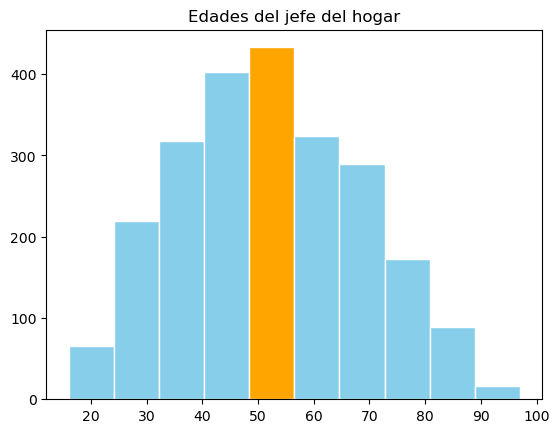

# Sesión 04: Visualización de datos
Dificultad 😀😀😀😀 (fácil)  
Uso de código: 🐍🐍🐍 (regular)

## 4.1 Visualización en Pandas y Matplotlib
En esta práctica utilizaremos el archivo "b02_enigh_2020" que incluye las variables principales de la ENIGH 2020 (Encuesta Nacional de Ingreso y Gasto en Hogares) con observaciones de los principales municipios de la zona metropolitana de Monterrey. 


```python
# Importa la biblioteca de pandas
import pandas as pd
```


```python
# Carga el archivo 'data/b03_enigh2020.xlsx' en un dataframe "df"
df = pd.read_excel('data/b03_enigh2020.xlsx')
```


```python
# Revisa las variables y evalúa si hay datos perdidos en una columna
df.info()
```

    <class 'pandas.core.frame.DataFrame'>
    RangeIndex: 2332 entries, 0 to 2331
    Data columns (total 24 columns):
     #   Column      Non-Null Count  Dtype  
    ---  ------      --------------  -----  
     0   folioviv    2332 non-null   int64  
     1   ubica_geo   2332 non-null   object 
     2   clave_mun   2332 non-null   int64  
     3   tam_loc     2332 non-null   int64  
     4   est_socio   2332 non-null   object 
     5   clase_hog   2332 non-null   object 
     6   sexo_jefe   2332 non-null   object 
     7   edad_jefe   2332 non-null   int64  
     8   educa_jefe  2332 non-null   int64  
     9   tot_integ   2332 non-null   int64  
     10  hombres     2332 non-null   int64  
     11  mujeres     2332 non-null   int64  
     12  p65mas      2332 non-null   int64  
     13  ing_cor     2332 non-null   float64
     14  gasto_mon   2332 non-null   float64
     15  alimentos   2332 non-null   float64
     16  cereales    2332 non-null   float64
     17  carnes      2332 non-null   float64
     18  leche       2332 non-null   float64
     19  huevo       2332 non-null   float64
     20  bebidas     2332 non-null   float64
     21  agua        2332 non-null   float64
     22  energia     2332 non-null   float64
     23  cuida_pers  2332 non-null   float64
    dtypes: float64(11), int64(9), object(4)
    memory usage: 437.4+ KB


```python
# Identifica los hogares con ingresos mayores a 1,000,000
df[df['ing_cor']>1000000]
```


<div>
<style scoped>
    .dataframe tbody tr th:only-of-type {
        vertical-align: middle;
    }

    .dataframe tbody tr th {
        vertical-align: top;
    }

    .dataframe thead th {
        text-align: right;
    }
</style>
<table border="1" class="dataframe">
  <thead>
    <tr style="text-align: right;">
      <th></th>
      <th>folioviv</th>
      <th>ubica_geo</th>
      <th>clave_mun</th>
      <th>tam_loc</th>
      <th>est_socio</th>
      <th>clase_hog</th>
      <th>sexo_jefe</th>
      <th>edad_jefe</th>
      <th>educa_jefe</th>
      <th>tot_integ</th>
      <th>...</th>
      <th>gasto_mon</th>
      <th>alimentos</th>
      <th>cereales</th>
      <th>carnes</th>
      <th>leche</th>
      <th>huevo</th>
      <th>bebidas</th>
      <th>agua</th>
      <th>energia</th>
      <th>cuida_pers</th>
    </tr>
  </thead>
  <tbody>
    <tr>
      <th>244</th>
      <td>1901367504</td>
      <td>San_Pedro</td>
      <td>19</td>
      <td>1</td>
      <td>alto</td>
      <td>nuclear</td>
      <td>hombre</td>
      <td>45</td>
      <td>10</td>
      <td>4</td>
      <td>...</td>
      <td>727818.19</td>
      <td>155053.02</td>
      <td>3593.55</td>
      <td>18192.81</td>
      <td>10644.42</td>
      <td>0.00</td>
      <td>14129.99</td>
      <td>1800.0</td>
      <td>7350.0</td>
      <td>36838.95</td>
    </tr>
    <tr>
      <th>252</th>
      <td>1901397404</td>
      <td>San_Pedro</td>
      <td>19</td>
      <td>1</td>
      <td>alto</td>
      <td>nuclear</td>
      <td>hombre</td>
      <td>52</td>
      <td>10</td>
      <td>6</td>
      <td>...</td>
      <td>1007112.49</td>
      <td>24775.02</td>
      <td>1846.27</td>
      <td>3059.99</td>
      <td>2870.98</td>
      <td>1027.28</td>
      <td>1787.12</td>
      <td>1500.0</td>
      <td>16500.0</td>
      <td>5321.56</td>
    </tr>
    <tr>
      <th>275</th>
      <td>1901451602</td>
      <td>San_Pedro</td>
      <td>19</td>
      <td>1</td>
      <td>alto</td>
      <td>nuclear</td>
      <td>hombre</td>
      <td>47</td>
      <td>10</td>
      <td>5</td>
      <td>...</td>
      <td>253834.67</td>
      <td>0.00</td>
      <td>0.00</td>
      <td>0.00</td>
      <td>0.00</td>
      <td>0.00</td>
      <td>0.00</td>
      <td>3600.0</td>
      <td>7950.0</td>
      <td>0.00</td>
    </tr>
  </tbody>
</table>
<p>3 rows × 24 columns</p>
</div>


```python
# Filtra los datos a hogares con ingreso menores a 1,000,000.
df = df[df['ing_cor']<1000000]
```


```python
df.info()
```

    <class 'pandas.core.frame.DataFrame'>
    Index: 2329 entries, 0 to 2331
    Data columns (total 24 columns):
     #   Column      Non-Null Count  Dtype  
    ---  ------      --------------  -----  
     0   folioviv    2329 non-null   int64  
     1   ubica_geo   2329 non-null   object 
     2   clave_mun   2329 non-null   int64  
     3   tam_loc     2329 non-null   int64  
     4   est_socio   2329 non-null   object 
     5   clase_hog   2329 non-null   object 
     6   sexo_jefe   2329 non-null   object 
     7   edad_jefe   2329 non-null   int64  
     8   educa_jefe  2329 non-null   int64  
     9   tot_integ   2329 non-null   int64  
     10  hombres     2329 non-null   int64  
     11  mujeres     2329 non-null   int64  
     12  p65mas      2329 non-null   int64  
     13  ing_cor     2329 non-null   float64
     14  gasto_mon   2329 non-null   float64
     15  alimentos   2329 non-null   float64
     16  cereales    2329 non-null   float64
     17  carnes      2329 non-null   float64
     18  leche       2329 non-null   float64
     19  huevo       2329 non-null   float64
     20  bebidas     2329 non-null   float64
     21  agua        2329 non-null   float64
     22  energia     2329 non-null   float64
     23  cuida_pers  2329 non-null   float64
    dtypes: float64(11), int64(9), object(4)
    memory usage: 454.9+ KB


Seleccionemos una columna con una variable categórica. Por ejemplo, el sexo del jefe de familia ('sexo_jefe'). Obtén un conteo de la frecuencia en cada categoría. Recuerda que para una variable 'X' esto se puede obtener con el comando  `df['X'].value_counts()`


```python
# Obtén el conteo de la variable 'sexo_jefe'
df['sexo_jefe'].value_counts()
```


    sexo_jefe
    hombre    1777
    mujer      552
    Name: count, dtype: int64


**Diagramas de pastel** Los dataframes en Pandas tienen un método *plot* que permite crear fácilmente un gráfico. Por ejemplo, para una variable categórica "X", podemos crear un diagrama de pastel (pie) con el siguiente comando: `df.X.value_counts().plot(kind = 'pie')`. 


```python
# Crea un gráfico de pastel para la variable 'sexo_jefe'
df['sexo_jefe'].value_counts().plot(kind = 'pie');
```


    

    


Observa que aparece un texto antes del gráfico relacionada con el comando utilizado. Para evitar esto, repite el comando agregando un punto y coma al final.

**Diagramas de barra** Otra opción para variables categóricas son los diagramas de barra. Para ello se puede utilizar el parámetro *kind='bar'* para un gráfico vertical o *kind=barh* para gráficos horizontales. 


```python
# Crea un gráfico de barras horizontal para la variable 'ubica_geo'
df['sexo_jefe'].value_counts().plot(kind = 'barh');
```


    

    


Existen algunos parámetros para modificar la apariencia del gráfico. Por ejemplo *width* indica la proporción de espacio que ocupan las barras, que dede manera predeterminada es 0.5 (*쯣or qué es importante dejar un hueco entre las barras?*). El parámetro *alpha* sirve para agregar un nivel de transparencia desde completamente transparente (0) hasta completamente opaco (1). Con *color* podemos establecer una lista de colores codificados.


```python
# Realiza de nuevo el gráfico anterior para modificar los parámetros widht, alpha y color
df['sexo_jefe'].value_counts().plot(kind='barh', width=0.8, color='green');
```


    

    


Para ejemplificar gráficos más complejos utilizaremos como referencia una tabla cruzada a partir de una tabla pivote. Crearemos esta tabla con la instrucción `tabla = df.pivot_table(index='ubica_geo', columns='sexo_jefe', values='tot_integ', aggfunc='sum')`. Las filas serán los diferentes municipios, las columnas el sexo del jefe de familia y los valores dentro de la tabla serán la suma de cada combinación de nombre y categoría


```python
# Crear tabla pivote
tabla = df.pivot_table(index='ubica_geo', columns='sexo_jefe', values='tot_integ', aggfunc='sum')
```


```python
tabla
```


<div>
<style scoped>
    .dataframe tbody tr th:only-of-type {
        vertical-align: middle;
    }

    .dataframe tbody tr th {
        vertical-align: top;
    }

    .dataframe thead th {
        text-align: right;
    }
</style>
<table border="1" class="dataframe">
  <thead>
    <tr style="text-align: right;">
      <th>sexo_jefe</th>
      <th>hombre</th>
      <th>mujer</th>
    </tr>
    <tr>
      <th>ubica_geo</th>
      <th></th>
      <th></th>
    </tr>
  </thead>
  <tbody>
    <tr>
      <th>Apodaca</th>
      <td>748</td>
      <td>187</td>
    </tr>
    <tr>
      <th>Cadereyta</th>
      <td>522</td>
      <td>93</td>
    </tr>
    <tr>
      <th>Escobedo</th>
      <td>944</td>
      <td>200</td>
    </tr>
    <tr>
      <th>Garcia</th>
      <td>391</td>
      <td>57</td>
    </tr>
    <tr>
      <th>Guadalupe</th>
      <td>680</td>
      <td>217</td>
    </tr>
    <tr>
      <th>Juarez</th>
      <td>625</td>
      <td>152</td>
    </tr>
    <tr>
      <th>Monterrey</th>
      <td>868</td>
      <td>266</td>
    </tr>
    <tr>
      <th>Pesqueria</th>
      <td>379</td>
      <td>81</td>
    </tr>
    <tr>
      <th>San_Nicolas</th>
      <td>473</td>
      <td>161</td>
    </tr>
    <tr>
      <th>San_Pedro</th>
      <td>347</td>
      <td>118</td>
    </tr>
    <tr>
      <th>Santa_Catarina</th>
      <td>472</td>
      <td>131</td>
    </tr>
  </tbody>
</table>
</div>


```python
# Construye un gráfico de barras para "tabla". Modifica y agrega el parámetro 'stacked=True'
tabla.plot(kind='bar', stacked=True)
```


    <Axes: xlabel='ubica_geo'>


    

    


Si nos interesa mostrar más de un gráfico se utiliza el parámetro *subplots=True*


```python
# Construye gráficos de barras para tablas utilizando subplots=True
tabla.plot(kind='bar', subplots=True)
```


    array([<Axes: title={'center': 'hombre'}, xlabel='ubica_geo'>,
           <Axes: title={'center': 'mujer'}, xlabel='ubica_geo'>],
          dtype=object)


    

    


Otro gráfico disponible es *'scatter'* para los diagramas de dispersión. Por ejemplo:  
`df.plot(kind='scatter', x='ing_cor', y='gasto_mon')` 


```python
# Crea un diagrama de dispersión para ingreso corriente y gasto monetario
df.plot(kind='scatter', x='ing_cor', y='gasto_mon')
```


    <Axes: xlabel='ing_cor', ylabel='gasto_mon'>


    

    


## 4.2 Gráficos con Matplotlib
Para realizar gráficos más complejos es necesario utilizar otros paquetes como *Seaborn*. La estructura general de una función en Seaborn es `sns.plotClass(x=Xvar, y=Yvar, data=data, kind=kind, options)` en la cual sns es el alias de Seaborn, *plotClass* es una familia de gráficos.  
Tanto Pandas como Seaborn están construidas con el paquete *Matplotlib* interactuando con el módulo *pyplot*. Por lo tanto, se requiere importar el módulo *pyplot* aunque no lo utilices directamente. Para importarlo utiliza el comando `import matplotlib.pyplot as plt`


```python
# Importa pyplot
import matplotlib.pyplot as plt
```

En la terminología de matplotlib, los gráficos se hace en un contenedor llamado figura (*figure*), y cada gráfico  se crea dentro de un área definida por ejes (*axis*). Puedes crear una figura con `fig = plt.figure()` en la cual de manera predeterminada solo hay un *axis* pero puedes definir este conjunto de ejes al crear la *figure*. Por ejemplo,  `fig, axis = plt.subplots(nrows=1, ncols=1)` para un 1x1 conjunto de ejes o `fig, axis = plt.subplots(2,2)` para crear 4 conjuntos de ejes. 
Cada *axis* se nombra, generalmente, como *ax*. Entonces es común encontrar instrucciones como    
`fig, ax = plt.subplots()`  
`fig, axs = plt.subplots(2,2)`  
`fig, (ax1, ax2) = plt.subplots(1,2)`  


Algunas instrucciones básicas son:  
| Componente | Ejemplo |
|-------------|--------|
| Título de la figura | fig.suptitle('*Título*') |
| Título del axis | ax.set_title('*Título del conjunto de ejes*') |  
| Etiqueta eje x | ax.set_xlabel('*Etiqueta eje X*') |  
| Etiqueta eje y | ax_set_ylabel('*Etiqueta eje Y*') |

## 4.3. Diagrama de dispersión

Para un diagrama de dispersión se puede utilizar la función `plt.scatter()`en la cual los primeros dos argumentos son las variables x y y. 


```python
# Ejemplo
fig, ax = plt.subplots() #genera el espacio
ax.scatter(df['ing_cor'], df['gasto_mon']) #grafico diagrama de dispercion 
ax.set_title('Ingreso y gasto en Hogares en ZMM') #nombre de las etiquetas del grafico
ax.set_xlabel('Ingreso trimestral por hogar') #eje X
ax.set_ylabel('Gasto trimestral por hogar'); #eje Y
```


    

    


```python
# Se crea un diccionario para asociar un color a cada estrato
colores = {'bajo':'red', 'medio_bajo':'orange', 'medio_alto':'yellow', 'alto':'green'}
# La función map() se puede usar para transformaciones simples elemento por elemento
color_estrato = df['est_socio'].map(colores)
```


```python
# Ejemplo
fig, ax = plt.subplots()
ax.scatter(df['ing_cor'], df['gasto_mon'], color = color_estrato)
ax.set_title('Ingreso y gasto en Hogares')
ax.set_xlabel('Ingreso')
ax.set_ylabel('Gasto')
#guardar la imagen
plt.savefig('images/grafico_dispersion.jpg');
```


    

    


```python
fig, (ax1, ax2) = plt.subplots(1, 2, figsize=(10,4)) #
fig.suptitle('Gasto en servicio de Agua y energia')

ax1.scatter(df['ing_cor'], df['agua'])
ax1.set_xlabel('Ingreso')
ax1.set_ylabel('Agua')

ax2.scatter(df['ing_cor'], df['energia'])
ax2.set_xlabel('Ingreso')
ax2.set_ylabel('Energía')
# Ajusta el diseño
plt.tight_layout();
```


    

    


### 4.4 Diagrama de pastel


```python
conteo_estratos = df['est_socio'].value_counts()
# pd.DataFrame sirve para convertirlo a dataframe
fig, ax = plt.subplots()
ax.pie(conteo_estratos, labels=conteo_estratos.index,
      colors=['gold', 'coral', 'limegreen', 'lavender'],
      explode = (0,0, 0.2, 0))
plt.show();
```


    

    


Otros colores pueden ser:
- Básicos: blue, red, green, cyan, magenta, yellow, black, white.
- Modificados: skyblue, navy, forestgreen, chocolate, purple, pink, orange, gray
- Otros (X11): aliceblue, blanchedalmond, cornflowerblue, darkgoldenrod, lavender, lightcoral, olive, rosybrown, wheat. 

## 4.5 Histograma

Un histograma se puede crear con *hist()*. El primer argumento es el conjunto de datos. Los *bins* corresponden a las barras.


```python
fig, ax = plt.subplots()
h=ax.hist(df['edad_jefe'], bins=10, color='skyblue', edgecolor='white', cumulative=False)
h[2][4].set_facecolor('orange')
ax.set_title('Edades del jefe del hogar')
plt.show();
```


    

    


## 4.6 Diagrama de caja (boxplot)


```python
fig, ax = plt.subplots()
ax.boxplot(df['tot_integ'])
ax.set_title('Total de integrantes');
```


    

    


```python
df['clase_hog'].value_counts()
```


    clase_hog
    nuclear          1449
    ampliado          576
    unipersonal       267
    compuesto          24
    corresidentes      13
    Name: count, dtype: int64


```python

```
