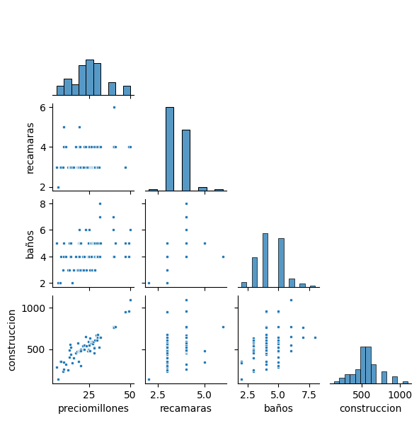
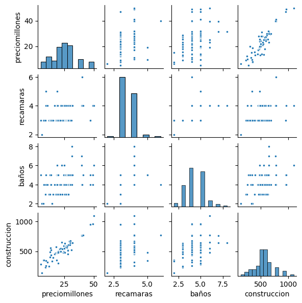
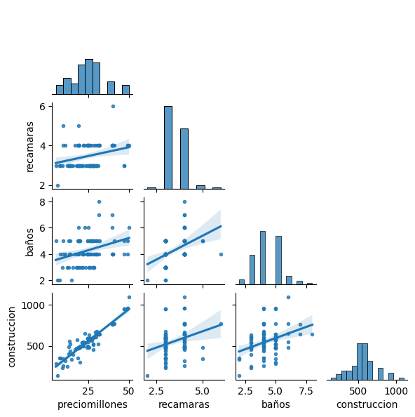
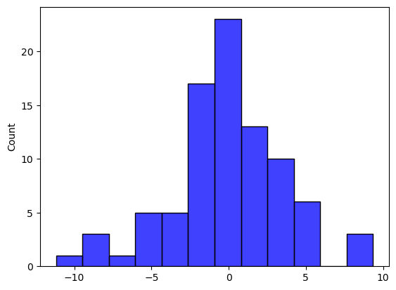
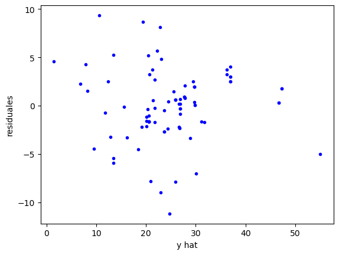

# Sesión 08: Análisis de regresión

Dificultad 😀😀 (muchos conceptos)  
Uso de código: 🐍🐍 (poco)


## ¿Qué es el análisis de regresión lineal?

El análisis de regresión lineal es una técnica que se utiliza para pronosticar o explicar el comportamiento de una variable *dependiente* con relación a una o más variables *independientes*. En el área de negocios, la variable dependiente generalmente es la variable que nos interesa explicar o pronosticar (por ejemplo *ventas*), mientras que las variables independientes son aquellas que nos sirven para explicar (por ejemplo *gasto en publicidad*).

Se asume que esta relación se ajusta a una ecuación lineal conocida como ecuación de regresión. Cuando sólo se tiene una variable independiente se conoce como regresión lineal simple: 
$$
y = \beta_0 + \beta_1 x  + \varepsilon
$$
El procedimiento más común para estimar esta ecuación de regresión es minimizando los errores al cuadrado en un método conocido como *mínimos cuadrados ordinarios*.

Ejemplo: https://phet.colorado.edu/sims/html/least-squares-regression/latest/least-squares-regression_en.html


## Interpretación de un modelo de regresión
En su planteamiento básico la ecuación o modelo de regresión múltiple es la siguiente:
$$
y = \beta_0 + \beta_1 x_1 + \beta_2 x_2 +...+ \beta_k x_k + \varepsilon
$$

Donde:
- $y$ es la variable dependiente.
- $x$ es la variable independiente. Si solo existe una variable independiente se conoce como *regresión lineal simple*, si son dos o más, se llama *regresión lineal múltiple*.
- $\beta_0$ es el término de intersección (constante o intercepto), es el valor que tomaría $y$ si todas las variables fueran igual a cero (esto solo tiene sentido en algunos casos). 
- $\beta_1$ es el coeficiente de regresión para cada $x$. Es el cambio estimado en la variable dependiente por unidad de cambio en la variable independiente, con todo lo demás constante.
- $\varepsilon$ es el término de error. Cuando corresponde al resultado de un modelo en específico es preferible referirse al error como *residual*

## Tamaño muestral
Existen varias recomendaciones para determinar qué tamaño de muestra es adecuado. Para generalizar los resultados, lo mínimo recomendable son 5 observaciones por cada variable independiente, aunque lo deseable es tener de 15 a 20 observaciones por cada variable independiente  (Hair, Black, Babin, & Anderson, 2009).
Green (1991) considera inadecuado establecer una constante (p. ej. 100 observaciones) pero sugiere que para evaluar un modelo se deben tener 50+8*k* observaciones, donde *k* es el número de variables independientes. Si se desea evaluar los coeficientes de regresión de cada variable recomienda 104+*k* observaciones.


## Ajuste del modelo
La métrica más utilizada para medir el ajuste del modelo es el *coeficiente de determinación* (R<sup>2</sup>) que mide la proporción de la variación de la variable dependiente que es explicada por el modelo. En un modelo de regresión lineal, la variación total de los datos  se mide con sumas de cuadrados:
$$
SS_{total} = SS_{modelo} + SS_{residual}
$$
Donde:

$SS_{total} = \sum_{i = 1}^{n} (y-\bar{y})^2$ es la suma de cuadrados total  
$SS_{modelo} = \sum_{i = 1}^{n} (\hat{y}-\bar{y})^2$ es la suma de cuadrados del modelo también conocida como suma de cuadrados explicada  
$SS_{residual} = \sum_{i = 1}^{n} (y-\hat{y})^2$ es la suma de cuadrados del residual o suma de cuadrados del error

El coeficiente de determinación es equivalente a

$$
R^2 = SS_{modelo} / SS_{total}
$$

La R cuadrada toma valores entre 0 y 1, donde valores más grandes indican un mejor ajuste. Sin embargo, no existen criterios únicos de qué valor de R cuadrada es aceptable, sino que ello depende del área de estudio

## Supuestos básicos del modelo
Las estimaciones de los coeficientes de regresión serán óptimas, de acuerdo al teorema de Gauss-Markov, si cumplen los siguientes supuestos con respecto al término de error:
- El error sigue una distribución normal.
- El error tenga media igual a cero.
- Los errores son independientes (no están relacionados entre sí).
- La varianza del error es constante.
Esto se resume como que e~N<sub>iid</sub> (0,σ<sup>2</sup>). Si se cumplen estos supuestos, los estimadores serán los mejores estimadores insesgados de mínima varianza (*MELI* por las siglas en español; *BLUE* por las siglas en inglés). 

## Homocedasticidad y normalidad
Uno de los supuestos del modelo de regresión es que la varianza de los residuales se mantiene constante (homocedasticidad). El cumplimiento de este supuesto se puede explorar en la gráfica del residual estandarizado versus $\hat{Y}$. Por ejemplo, un patrón de dispersión creciente (o decreciente) indicaría una violación a este supuesto.
La normalidad en la distribución de los errores y su media se puede verificar en el histograma de los residuales y una prueba de normalidad (como Shapiro-Wilks o  Kolmogorov-Smirnov). En la prueba de normalidad lo deseable es obtener un p-valor mayor a 0.05 (no se rechaza la hipótesis nula de normalidad en los datos)

## Independencia en los errores
Los errores deben ser independientes en una regresión, esto es, no relacionados entre sí.  Generalmente esto implica evaluar la autocorrelación (correlación entre valores adyacentes) y se lleva a cabo mediante la prueba de Durbin-Watson (solamente en series de tiempo). En esta prueba, el estadístico de prueba puede tomar valores entre 0 y 4. Si el estadístico es cercano a 2 entonces los residuales no están correlacionados. Valores menores a 1 o mayores a 3 son señal de un problema serio de autocorrelación. 

## Multicolinealidad
La multicolinealidad se presenta cuando existe una fuerte correlación entre dos o más variables independientes. La multicolinealidad puede llevar a tener un modelo estadísticamente significativo, pero coeficientes de regresión no significativos.

## Variables categóricas
En un análisis de regresión se pueden incluir variables categóricas. Si la variable categórica toma dos valores, se pueden codificar como una variable dicotómica con valores de “0” y “1”. La categoría que servirá de referencia se debe codificar como “0”. Si la variable categórica toma *k* valores se deben crear *k*-1 variables dicotómicas.

# Práctica

Utilizaremos un modelo de regresión para estimar el precio de una casa en una zona de la ciudad. Como primer paso importamos las bibliotecas a utilizar. En esta ocasión agregaremos la biblioteca `warnings` para evitar notificaciones de cambios futuros

### Notas
- encontrar la mejor linea que se ajusta a los putos o reduce los cuadrados

Var dep.        Var Ind
Cauntitativa
cuantitativa
cuantitativa


```python
# Importar bibliotecas
import warnings
warnings.simplefilter(action='ignore', category=FutureWarning)

import pandas as pd
import numpy as np
import matplotlib.pyplot as plt
import seaborn as sns
```


```python
# Importar el archivo "data/b01_casas.xlsx"
df = pd.read_excel('data/b01_casas.xlsx')
df = df[df['tipo']==0]
```


```python
# Revisar las variables y el número de observaciones
df.info()
```

    <class 'pandas.core.frame.DataFrame'>
    Index: 87 entries, 1 to 153
    Data columns (total 8 columns):
     #   Column          Non-Null Count  Dtype  
    ---  ------          --------------  -----  
     0   operacion       87 non-null     object 
     1   tipo            87 non-null     int64  
     2   municipio       87 non-null     object 
     3   colonia         87 non-null     object 
     4   preciomillones  87 non-null     float64
     5   recamaras       87 non-null     int64  
     6   baños           87 non-null     float64
     7   construccion    87 non-null     int64  
    dtypes: float64(2), int64(3), object(3)
    memory usage: 6.1+ KB


```python
# Revisar las primeras filas del DataFrame
df.head(3)
```


<div>

<table border="1" class="dataframe">
  <thead>
    <tr style="text-align: right;">
      <th></th>
      <th>operacion</th>
      <th>tipo</th>
      <th>municipio</th>
      <th>colonia</th>
      <th>preciomillones</th>
      <th>recamaras</th>
      <th>baños</th>
      <th>construccion</th>
    </tr>
  </thead>
  <tbody>
    <tr>
      <th>1</th>
      <td>Venta</td>
      <td>0</td>
      <td>San Pedro Garza García</td>
      <td>Colonia Del Valle</td>
      <td>5.10</td>
      <td>3</td>
      <td>5.0</td>
      <td>280</td>
    </tr>
    <tr>
      <th>6</th>
      <td>Venta</td>
      <td>0</td>
      <td>San Pedro Garza García</td>
      <td>Colonia Del Valle</td>
      <td>6.11</td>
      <td>2</td>
      <td>2.0</td>
      <td>135</td>
    </tr>
    <tr>
      <th>11</th>
      <td>Venta</td>
      <td>0</td>
      <td>San Pedro Garza García</td>
      <td>Colonia Del Valle</td>
      <td>7.50</td>
      <td>3</td>
      <td>2.0</td>
      <td>350</td>
    </tr>
  </tbody>
</table>
</div>


## Análisis descriptivo exploratorio


```python
# Identifica las variables cuantitativasy obtener la estadística descriptiva
var_cont = df[['preciomillones', 'recamaras', 'baños', 'construccion']]
var_cont.describe().T
```


<div>

<table border="1" class="dataframe">
  <thead>
    <tr style="text-align: right;">
      <th></th>
      <th>count</th>
      <th>mean</th>
      <th>std</th>
      <th>min</th>
      <th>25%</th>
      <th>50%</th>
      <th>75%</th>
      <th>max</th>
    </tr>
  </thead>
  <tbody>
    <tr>
      <th>preciomillones</th>
      <td>87.0</td>
      <td>24.820230</td>
      <td>10.061362</td>
      <td>5.1</td>
      <td>18.94</td>
      <td>24.95</td>
      <td>29.7</td>
      <td>49.98</td>
    </tr>
    <tr>
      <th>recamaras</th>
      <td>87.0</td>
      <td>3.471264</td>
      <td>0.625785</td>
      <td>2.0</td>
      <td>3.00</td>
      <td>3.00</td>
      <td>4.0</td>
      <td>6.00</td>
    </tr>
    <tr>
      <th>baños</th>
      <td>87.0</td>
      <td>4.287356</td>
      <td>1.098710</td>
      <td>2.0</td>
      <td>4.00</td>
      <td>4.00</td>
      <td>5.0</td>
      <td>8.00</td>
    </tr>
    <tr>
      <th>construccion</th>
      <td>87.0</td>
      <td>555.666667</td>
      <td>169.102533</td>
      <td>135.0</td>
      <td>478.00</td>
      <td>550.00</td>
      <td>635.0</td>
      <td>1100.00</td>
    </tr>
  </tbody>
</table>
</div>


```python
# Obtenemos la matriz de correlaciones
var_cont.corr()
```


<div>

<table border="1" class="dataframe">
  <thead>
    <tr style="text-align: right;">
      <th></th>
      <th>preciomillones</th>
      <th>recamaras</th>
      <th>baños</th>
      <th>construccion</th>
    </tr>
  </thead>
  <tbody>
    <tr>
      <th>preciomillones</th>
      <td>1.000000</td>
      <td>0.286920</td>
      <td>0.340400</td>
      <td>0.931844</td>
    </tr>
    <tr>
      <th>recamaras</th>
      <td>0.286920</td>
      <td>1.000000</td>
      <td>0.409580</td>
      <td>0.292359</td>
    </tr>
    <tr>
      <th>baños</th>
      <td>0.340400</td>
      <td>0.409580</td>
      <td>1.000000</td>
      <td>0.354188</td>
    </tr>
    <tr>
      <th>construccion</th>
      <td>0.931844</td>
      <td>0.292359</td>
      <td>0.354188</td>
      <td>1.000000</td>
    </tr>
  </tbody>
</table>
</div>


La función `sns.pairplot`es útil para visualizar las relaciones entre pares de variables en un DataFrame. El primer parámetro indica el nombre del DataFrame, *corner* sirve para mostrar solo la matriz triangular inferior, *kind* permite indicar el tipo de gráfico (observa cómo cambia con 'reg' en vez de 'scatter'), *makers* se utiliza para indicar el tipo de marcas en el gráfico (observa cómo cambia con '+' en vez de '.'), y *height*  es la altura en pulgadas de cada gráfico.


```python
# Graficamos las relaciones entre variables
sns.pairplot(var_cont, corner=True, kind='scatter', markers='.', height=1.5);
```


    

    


```python
# Graficamos las relaciones entre variables
sns.pairplot(var_cont, corner=False, kind='scatter', markers='.', height=1.5);
```


    

    


## Utilizando StatsModel


```python
# Graficamos las relaciones entre variables
sns.pairplot(var_cont, corner=True, kind='scatter', markers='*', height=1.5);
```


    

    


```python
# Graficamos las relaciones entre variables
sns.pairplot(var_cont, corner=True, kind='reg', markers='.', height=1.5);
```


    

    


Utilizaremos primero la biblioteca *StatsModel* para realizar el análisis de regresión


```python
# Importar la librería
import statsmodels.api as sm
```

Es recomendable crear un dataframe 'X' con las variables independientes y otro "y" con la variable dependiente. Para seleccionar las variables independientes primero evalúa cuáles pueden ser relevantes. Cuando se tienen muchas variables independientes se puede realizar un *Análisis Factorial* para reducir la dimensionalidad. Para este ejemplo, empezaremos con la variable "construcción". La opción de StatsModel que utilizaremos, requiere crear una columna de "1" para representar la constante en el modelo de regresión.


```python
# Creamos un DataFrame con las v. indep. y la v. dependiente
X = df[['construccion', 'tipo']]
X = sm.add_constant(X)
y = df['preciomillones']
```

Corremos el modelo de regresión mediante mínimos cuadrados ordinarios:
`regresion = sm.OLS(y, X).fit()`


```python
regresion = sm.OLS(y, X).fit()
```

El resultado se muestra con la instrucción
`regresion.summary()`.


```python
regresion.summary()
```

    /Users/a.antonio.del.angel/anaconda3/lib/python3.11/site-packages/statsmodels/regression/linear_model.py:1965: RuntimeWarning: divide by zero encountered in scalar divide
      return np.sqrt(eigvals[0]/eigvals[-1])


<table class="simpletable">
<caption>OLS Regression Results</caption>
<tr>
  <th>Dep. Variable:</th>     <td>preciomillones</td>  <th>  R-squared:         </th> <td>   0.868</td>
</tr>
<tr>
  <th>Model:</th>                   <td>OLS</td>       <th>  Adj. R-squared:    </th> <td>   0.867</td>
</tr>
<tr>
  <th>Method:</th>             <td>Least Squares</td>  <th>  F-statistic:       </th> <td>   560.6</td>
</tr>
<tr>
  <th>Date:</th>             <td>Sat, 14 Sep 2024</td> <th>  Prob (F-statistic):</th> <td>3.50e-39</td>
</tr>
<tr>
  <th>Time:</th>                 <td>16:26:36</td>     <th>  Log-Likelihood:    </th> <td> -235.61</td>
</tr>
<tr>
  <th>No. Observations:</th>      <td>    87</td>      <th>  AIC:               </th> <td>   475.2</td>
</tr>
<tr>
  <th>Df Residuals:</th>          <td>    85</td>      <th>  BIC:               </th> <td>   480.1</td>
</tr>
<tr>
  <th>Df Model:</th>              <td>     1</td>      <th>                     </th>     <td> </td>   
</tr>
<tr>
  <th>Covariance Type:</th>      <td>nonrobust</td>    <th>                     </th>     <td> </td>   
</tr>
</table>
<table class="simpletable">
<tr>
        <td></td>          <th>coef</th>     <th>std err</th>      <th>t</th>      <th>P>|t|</th>  <th>[0.025</th>    <th>0.975]</th>  
</tr>
<tr>
  <th>const</th>        <td>   -5.9878</td> <td>    1.359</td> <td>   -4.405</td> <td> 0.000</td> <td>   -8.691</td> <td>   -3.285</td>
</tr>
<tr>
  <th>construccion</th> <td>    0.0554</td> <td>    0.002</td> <td>   23.676</td> <td> 0.000</td> <td>    0.051</td> <td>    0.060</td>
</tr>
<tr>
  <th>tipo</th>         <td>         0</td> <td>        0</td> <td>      nan</td> <td>   nan</td> <td>        0</td> <td>        0</td>
</tr>
</table>
<table class="simpletable">
<tr>
  <th>Omnibus:</th>       <td> 4.411</td> <th>  Durbin-Watson:     </th> <td>   1.470</td>
</tr>
<tr>
  <th>Prob(Omnibus):</th> <td> 0.110</td> <th>  Jarque-Bera (JB):  </th> <td>   4.309</td>
</tr>
<tr>
  <th>Skew:</th>          <td>-0.282</td> <th>  Prob(JB):          </th> <td>   0.116</td>
</tr>
<tr>
  <th>Kurtosis:</th>      <td> 3.933</td> <th>  Cond. No.          </th> <td>     inf</td>
</tr>
</table><br/><br/>Notes:<br/>[1] Standard Errors assume that the covariance matrix of the errors is correctly specified.<br/>[2] The smallest eigenvalue is      0. This might indicate that there are<br/>strong multicollinearity problems or that the design matrix is singular.


- **R-squared:** que sea cercano a 1, entre mas cerca, mas se ajustan las variables al modelo
- **F-statistic:** Si el modelo es significativo, grados de libertad
- **Prob (F-statistic):** sea menor que - 0.50
- **AIC**
- **BIC**
- **Coef de const**
- **Coef de construccion**


```python
# Creamos un DataFrame con las v. indep. y la v. dependiente
X = df[['construccion']]
X = sm.add_constant(X)
y = df['preciomillones']
```

### Interpretación de los resultados
- R-squared: entre más cercano a 1 es mejor
- Adj. R-squared: se utiliza para comparar modelos con diferente número de variables independientes, debido a que la R cuadrada ajustada penaliza el incluir variables no significativas.
- AIC / BIC: también se utilizan para comparar modelos de regresión múltiple, menos es mejor.
- F-statistic: evalúa la significancia del modelo en conjunto, la hipótesis nula es que todos los coeficientes de regresión son iguales a cero.
- Skew: o *sesgo* es una medida de la asimetría de la distribución
- Kurtosis: indica qué tan "puntiaguda" o "achatada" es una distribución.
- Prob(Omnibus): es una prueba para evaluar la normalidad en los residuales.
- Jarque-Bera(JB) es un estadístico que sirve para evaluar la normalidad en los residuales.
- Durbin-Watson: sirve para evaluar la presencia de autocorrelación. Valores entre 0 y 2 indican una autocorrelación positiva y valores entre 2 y 4 indican una autocorrelación negativa. Valores cercanos a 2 son deseables.
- Cond. No. es el número de condición, que sirve para evalur problemas de multicolinealidad. Valores arriba de 30 se consideran problemáticos.


```python
regresion.params
```


    const          -5.987831
    construccion    0.055443
    dtype: float64


```python
residuales = regresion.resid
```


```python
y_hat = regresion.predict(X)
```


```python
nuevos_valores = [1,500]
regresion.predict(nuevos_valores)
```


    array([21.73387944])


## Utilizando scikit-learn


```python
# Importar la biblioteca
from sklearn.linear_model import LinearRegression
```

Con *SciKit-Learn' no se agrega la columna de constantes como en StatsModel


```python
X = df[['construccion']]
y = df['preciomillones']
model = LinearRegression().fit(X, y)
```


```python
# Obtener los coeficientes de regresión
model.intercept_, model.coef_
```


    (-5.987831116126014, array([0.05544342]))


```python
# Obtener y estimada (y hat)
y_hat = model.predict(X)
```


```python
# Obtener residuales
residuales = (y - y_hat).values
```


```python
# Calcular R cuadrada
from sklearn.metrics import r2_score
r2_score(y, y_hat)
```


    0.8683337876128375


## Evaluación de supuestos
### Multicolinealidad

Para evaluar la multicolinealidad:
- Revisar la matriz de correlaciones de las variables independientes para identificar correlaciones arriba de 0.90
- Revisar el número de condición, valores mayores a 30 indicarían un problema grave
- Calcular el Factor de Inflación de Varianza de cada variable, valores mayores a 10 indicarían un problema grave

### Normalidad


```python
sns.histplot(residuales, color='b');
```


    

    


```python
from scipy.stats import shapiro
stat, p_value = shapiro(residuales)
print("Estadístico de prueba:", stat)
print("Valor p:", p_value)

# Interpretar los resultados
alpha = 0.05
if p_value < alpha:
    print("Se rechaza la hipótesis nula de normalidad en los datos")
else:
    print("No se puede rechazar la hipótesis nula de normalidad en los datos")
```

    Estadístico de prueba: 0.9775407314300537
    Valor p: 0.13461335003376007
    No se puede rechazar la hipótesis nula de normalidad en los datos


### Homocedasticidad
Existen varias pruebas que se pueden realizar para evaluar la presencia de heteroscedasticidad, tales como:
- Breusch-Pagan: calcula la relación entre los residuales al cuadrado y las variables independientes, si la relación es significativa indica heteroscedasticidad..
- Prueba de White: similar a la Breush-Pagan, considera la correlación serial.
- Prueba de Goldfeld-Quandt: divide los datos con base en los valores de una variable independiente y compara las varianzas de los residuales en ambos grupos.


```python
# Gráfico de residuales
plt.scatter(y_hat, residuales, marker='.', color='b')
plt.xlabel('y hat')
plt.ylabel('residuales');
```


    

    


```python
from statsmodels.stats.diagnostic import het_breuschpagan

X = df[['construccion']]
X = sm.add_constant(X)
y = df['preciomillones']
model = sm.OLS(y, X)
resultado = model.fit()
residuales = resultado.resid

lm, lm_p_value, fvalue, f_p_value = het_breuschpagan(residuales, X)

print("Estadístico LM:", lm)
print("Valor p del estadístico LM:", lm_p_value)
print("Estadístico F:", fvalue)
print("Valor p del estadístico F:", f_p_value)
```

    Estadístico LM: 2.5299401127233327
    Valor p del estadístico LM: 0.11170445575061645
    Estadístico F: 2.545812206934095
    Valor p del estadístico F: 0.11429860558756973


Si el p-valor es menor que 0.05 es evidencia de la presencia de heteroscedasticidad


```python

```
